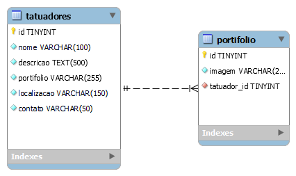

# InkWizards

Site criado para o projeto integrador da QT2 - Back-End na instituição Senac Penha no curso de Téc. em Informática para Internet

"Nossa ideia é criar um site que possa auxiliar tatuadores que não possuem muita visibilidade a divulgarem seus portfólios. Através de uma interface intuitiva e de fácil utilização, nosso objetivo é simplificar a experiência do usuário. Garantimos suporte e segurança para seus dados, permitindo que eles alcancem mais pessoas e ampliem sua presença online." 

## Documentação do Projeto

### MySQL Workbench (Modelo Lógico do DATABASE)

